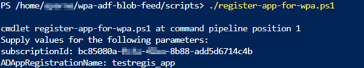
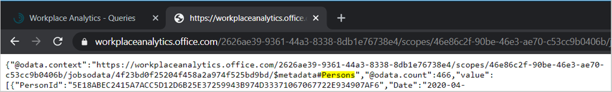
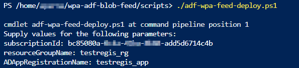

# Automate query data export to Azure with PowerShell

Do you need to combine Workplace Analytics query data with other Azure data sources, such as HR or Sales data for more advanced data analytics and reporting? Are you manually downloading large amounts of static query data from Workplace Analytics and then uploading it into Azure on a routine basis?

With Azure Data Factory and Azure Active Directory, you can automate the export of Workplace Analytics query data through the OData query link to connect and refresh an Azure data store of your choice.

You can then join dynamically refreshed Workplace Analytics query data with other organizational datasets for more advanced analysis and data science projects.

## Pick a setup path

To set up the automated OData connection between Workplace Analytics query data and your choice Azure data store, you can use one of the following paths to create and configure a new Azure analytics app, which needs company-specific information (secrets) about your private network and your choice data store.

* [Set up with Azure Data Factory UI](https://docs.microsoft.com/Workplace-Analytics/data-access/query-data-export) – This path steps you through creating and registering an app and creating a data factory for the data export through the Azure Data Factory UI.
* [Set up with Azure PowerShell](#to-set-up-with-powershell) – Automates the process end-to-end through PowerShell with predefined scripts that create and register the app, prompt for your organization’s specific parameters, and create and deploy the data factory.

## Prerequisites

* **Workplace Analytics licensed analyst** – Must be assigned a license and an Analyst role for Workplace Analytics and have query results with the data you want to export.
* **Microsoft Azure subscription** – If you don't have an Azure subscription, create a [free account](https://azure.microsoft.com/free/) now. You need to use [Azure Active Directory](https://docs.microsoft.com/azure/active-directory/), [OData connector](https://docs.microsoft.com/azure/data-factory/connector-odata#supported-capabilities), and [Data Factory](https://docs.microsoft.com/rest/api/datafactory/) for this setup.
* **Azure data store** – Your data store must be [supported by the OData connector](https://docs.microsoft.com/azure/data-factory/connector-odata).
* **Azure admin** – Azure admin privileges are required to create and register the app in Azure. You also need to ask the Azure global admin to grant you permissions in Azure Data Factory to connect your new app to the Azure data store. To create Data Factory instances, the account you sign in to Azure with must have the contributor or owner role, or be an administrator of the Azure subscription.

## To set up with PowerShell

The following uses [Azure PowerShell](https://docs.microsoft.com/azure/data-factory/quickstart-create-data-factory-powershell) to create and register a new analytics app and deploy the data factory for the export end to end.

You can then use this new data factory to access query data from Workplace Analytics and copy it to your choice data store (blob storage) by using the Azure Resource Manager template. You can reuse this new app over time for multiple projects without having to repeat these steps. You can also reuse the data factory you created for new pipelines.

1. Confirm the following additional prerequisites.

   * **Azure PowerShell** or **Azure CLI** – You must use the latest available version of [Azure PowerShell](https://docs.microsoft.com/powershell/azure/install-az-ps?view=azps-4.3.0&viewFallbackFrom=azps-3.3.0) or [Azure command-line interface (Azure CLI)](https://docs.microsoft.com/cli/azure/?view=azure-cli-latest) to run these scripts.
   * **.NET Framework**– You also must use .NET Framework 4.7.2 or the latest available version.
   * **GitHub** – [Join GitHub as a contributor](https://docs.microsoft.com/contribute/get-started-setup-github) for [Microsoft 365 Insights](https://github.com/microsoftgraph/M365Insights), which enables you to access the script provided for this setup path.

2. Open PowerShell, and then log in to your Azure subscription as an admin with applicable privileges granted by the global admin:

   ```
   Connect-AzAccount
   ```

   > [!Important]
   > Your global admin must grant you admin privileges before you can continue to the next step.

3. If you have multiple Azure subscriptions, run the following to choose which subscription to use for this data factory:

   ```
   Select-AzureAzSubscription
   ```

4. In PowerShell, run the following command and enter these configuration inputs to register the Azure app, as shown in the following graphic.

   ```
   ./register-app-for-wpa.ps1
   ```

   - **Subscription ID** - Azure subscription ID to use for this app
   - **Resource Group Name** - Name the group to use for this app
   - **AD App Registration Name** - Name of the new app
   - **Resource Group Location** - Uses an existing one as the default. You can specify a new one and the script will create it for you.

    

    > [!Important]
    > For automatically refreshed data, you must link to a Workplace Analytics query that uses the [Auto-refresh option](https://docs.microsoft.com/workplace-analytics/tutorials/query-auto-refresh#create-a-query-with-the-auto-refresh-option). For static query results, you’ll need to enter a new OData link each time to update the query data in the connected Azure data store.

5. In the [scripts folder](https://github.com/microsoftgraph/M365Insights/tree/master/scripts), right-click and select **Save link as**, and then select a folder to download each of the following files that are required for this setup.

    * **template.json**
    * **template-params.json**
    * **adf-wpa-feed-deploy.ps1**
    * **register-app-for-wpa.ps1**
    * **show-app-info.ps1**

6. In PowerShell, run the following and edit the applicable parameters:

    ```
    template-params.json
    ```

    Edit the following to specify new parameters or confirm the defaults in the file for the storage and Azure Data Factory specifications:

      - **skipStorageCreation** - To use existing storage, keep default **Yes** value. To create new storage, change it to **No**.
      - **wpaReaderAppSecretName** - The secret name to use for this app.
      - **skipVaultCreation** - You can reuse an existing key or vault in the same resource group. To use an existing key vault, keep default **Yes** value. To create a new key vault, change it to **No**.
      - **wpaKeyVaultName** - Key vault name of the existing or new vault.
      - **wpaAppStorageAccType** - Name of the storage account type to use for this app, such as **Standard_LRS**.
      - **wpaAppStorageAccName** - Name of the storage account to use for this app.
      - **storageTargetBlobFolderPath** - The path of the target storage blob location.
      - **wpaAppDataFactoryName** - Name of the Azure Data factory to use for this app.
      - **wpaADFJobName** - Name of the Azure Data factory job, such as **PersonEmailStats**.
      - **wpaEntityName** - Name of the query data entity this app will use. For example **Persons** or **Meetings**, see the following note for details on how to find it.
      - **wpaSourceODataFeedUrl** - OData URL of the query data that you must copy from within Workplace Analytics. See the following note to locate it.


      > [!Note]
      > To find the entity name, which is in the OData link used for the Workplace Analytics query data export:
      > 
      > 1. Copy the OData query link from [Workplace Analytics](https://workplaceanalytics.office.com/) > **Queries** > **Results** and open it in a new browser window.
      > 2. Then search for **metadata** to find the entity name, which is shown after **$metadata#**. For example, the entity name shown in the following graphic is **Persons**.
      > 
      > 

7. After you enter or confirm the correct parameter variables, run the following script in PowerShell to deploy the template, as shown in the following graphic.

   ```
   ./adf-wpa-feed-deploy.ps1
   ```

    

8. Open the **Azure Resource group** to confirm your new app is available.<!-- The following graphic shows an example resource group that includes the new data factory, its applicable key vault, and the deployed storage.-->

    You can also view the app in **Azure Active Directory** > **All applications** > enter the name of the app to search for it.<!-- Then you can select it to view it. For example, this shows the rvtest_app:-->

## Frequently asked questions

#### Q1. Can I use an Azure Resource Manager template to run the script?

No, you can only use PowerShell to complete these steps. PowerShell is required for the Active Directory Creation with Service Principal and to Create Secrets Automatically. After the data factory is set up with the new app, you can skip PowerShell for subsequent incremental deployments.

#### Q2. Can I deploy multiple pipelines with the same Azure Directory Factory and Resource Group?

Yes, you can use the "wpaADFJobName" parameter to deploy the new data factory you set up for other pipelines moving forward.

[](https://portal.azure.com/#create/Microsoft.Template/uri/https%3A%2F%2Fraw.githubusercontent.com%2Fnk-gears%2Fwpa-adf-blob-feed%2Fmaster%2Ftemplate.json)

## Related topic

[Automate query data export to Azure with Azure Data Factory UI](https://docs.microsoft.com/Workplace-Analytics/data-access/query-data-export)
